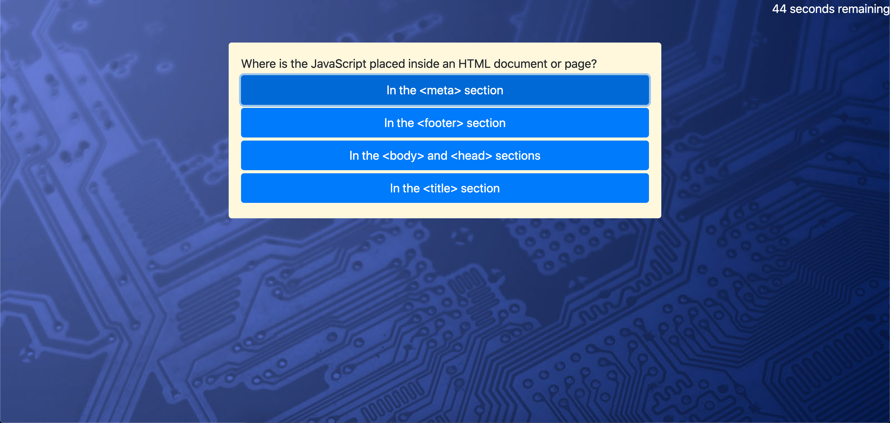

# Code Quiz

## About this project
The prupose of this project was to create a coding quiz utilizing JavaScript. Upon clicking star quiz, the user will be presented with up to five consecutive questions as a timer counts down from 60 secons. Each wrong answer will deduct 10 seconds from the timer. If the timer reaches 0, or all questions are answered, the quiz is over. At this point, the user will be redirected to the high scores page where they can log their name and score. The score is equal to the amount of seconds remaining when all questions have been answered. 

## Deployed link

## Future development
* Reverse name and score arrays so that new score is posted to top instead of bottom
* Add input validation to name prompt 
* Refactor high score page so that user cannot make additional entries by using refresh
* Add view high scores button to main quiz page
* Add clear high scores button to high scores page
* Add back to quiz button to high scores page

## Josh Thorngren 